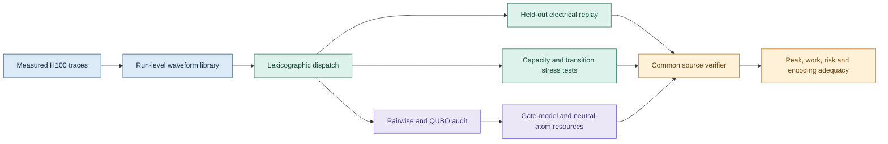

<div align="center">

# PowerShape-Q

**Waveform-aware energy scheduling for generative-AI infrastructure, with an
auditable path from physical constraints to quantum resources**

[](https://www.python.org/) [](https://docs.scipy.org/doc/scipy/reference/generated/scipy.optimize.milp.html) [](https://data.nlr.gov/submissions/312) [](#quantum-encoding-and-hardware-study)

[Method](#method) · [Results](#result-snapshot) · [Quantum hardware](#hardware-platforms) · [Execution](#qpu-execution-workflows) · [Reproduction](#running-the-analyses)

</div>

PowerShape-Q is the computational companion to a study of waveform-aware
energy scheduling for deferrable generative-AI inference batches. It connects
measured NVIDIA H100 power traces to certified mixed-integer schedules,
held-out electrical replay and encoding-aware quantum resource estimation.

The central premise is simple. Two schedules can complete the same work and
consume the same workload energy while imposing materially different peaks and
ramps on the electrical infrastructure. PowerShape-Q retains the measured
waveform throughout optimisation and verifies every classical or quantum
candidate against the same source constraints.



## Method

### Measured waveform library

The analysis uses the public NLR generative-AI workload power profiles. Twelve
offline-inference cells span six requested batch sizes and two output lengths.
Within each cell, ten runs form the training library and five unseen runs are
reserved for replay. The observed medoid is an actual run, so duration, energy,
peak and waveform shape remain jointly consistent.

Three representations are evaluated:

1. **Observed medoid** — one measured training run per workload cell.
2. **95% envelope** — a pointwise training quantile with a fixed measurement
   margin.
3. **Robust envelope** — the pointwise maximum over the training runs, with the
   same fixed margin.

### State-complete electrical model

Each binary variable $x_v$ selects one admissible placement $v$, including its
job, start time, occupancy interval, request value and measured incremental
power waveform $Q_v(t)$. Total IT power is

$$
P_x^{\mathrm{IT}}(t)
=N b^{\mathrm{idle}}+\sum_{v\in\mathcal V}Q_v(t)x_v,
$$

where $N=12$ powered nodes and $b^{\mathrm{idle}}=418.2$ W per node. The
model enforces one placement per job, aggregate occupancy, total feeder power
and signed average ramp constraints over
$h\in\lbrace 1,5,30\rbrace$ seconds:

$$
P_x^{\mathrm{IT}}(t)\le P_{\mathrm{feeder}}^{\max},
\qquad
\left|\frac{P_x^{\mathrm{IT}}(t)-P_x^{\mathrm{IT}}(t-h)}{h\Delta t}\right|
\le C_R.
$$

Idle-to-active and active-to-idle boundaries are part of each placement
waveform. A separate transition-robust campaign jointly reserves every integer
transition duration from 1 to 5 seconds.

### Lexicographic scheduling

The solver separates admission from peak shaping. Stage one maximises admitted
requests over the physical feasible set $\mathcal F$:

$$
\boldsymbol{x}^{\star}\in
\arg\max_{\boldsymbol{x}\in\mathcal F}
\sum_{v\in\mathcal V} w_vx_v.
$$

Stage two fixes the admitted job set returned by stage one and minimises the
incremental peak:

$$
(\boldsymbol{x}^{\dagger},z^{\dagger})\in
\arg\min z
\quad\text{subject to}\quad
\boldsymbol{x}\in\mathcal F,
\quad
\sum_v Q_v(t)x_v\le z\quad\forall t.
$$

An earliest-feasible schedule is solved for the identical admitted jobs under
the identical physical constraints. The paired comparison therefore measures
placement-induced peak reduction rather than comparing a feasible schedule
with an overloaded counterfactual.

### Held-out risk evaluation

Every optimised schedule is replayed on combinations of unseen measured runs.
The replay records feeder-power, ramp, occupancy and deadline violations as
well as peak and ramp utilisation. Tight-cap experiments at 10, 12 and 14 kW
are summarised with a one-sided 95% Clopper-Pearson upper bound against a
pre-declared 1% power-violation threshold.

## Result snapshot

| Evidence layer | Retained result |
|---|---|
| Optimisation certification | All admission, equal-work peak and earliest-feasible stages are certified across 24 instances and three formulations. |
| Robust admitted work | Median 6,375 requests in 15 batches. |
| Equal-work peak shaping | Median total-IT peak falls from 19.110 to 12.580 kW, a paired reduction of 37.2%. |
| Primary held-out replay | All 4,800 robust replays satisfy power, ramp, occupancy and deadline constraints at 26 kW. |
| Capacity calibration | Binding-cap replay and a one-sided Clopper-Pearson gate quantify deployment headroom. |
| Transition uncertainty | Re-optimisation over the joint 1--5 s set remains feasible in every retained replay. |

These figures are generated directly by the analysis modules and retained in
the machine-readable outputs used by the manuscript.

## Quantum encoding and hardware study

The quantum analysis starts from the same placement catalogue and keeps four
objects distinct.

| Object | Size | Scientific role |
|---|---:|---|
| Pairwise conflict graph | 150 vertices, 675 edges | Tests whether pairwise exclusions preserve the higher-order feeder and ramp rows. |
| Compact quadratic proposal | 150 variables, 5,853 couplings | Ranks coincident power and ramp shape; 2,395 couplings are negative. |
| Quantised source-preserving register | 9,897 binary variables | Retains the declared power and three ramp inequalities through bounded slack bits. |
| Reduced hardware benchmark | 8 variables, 22 couplings | Fixes a circuit-scale instance for QPU execution, compilation and decoding checks. |

For the compact proposal, the normalised shaping objective is

$$
F(\boldsymbol{x})=
\lVert\widehat{\boldsymbol{P}}^{\mathsf T}\boldsymbol{x}\rVert_2^2
+\frac{1}{|\mathcal H|}\sum_{h\in\mathcal H}
\lVert\widehat{\boldsymbol{R}}_h^{\mathsf T}\boldsymbol{x}\rVert_2^2.
$$

The signed ramp terms can create negative Ising couplings. This matters for
both gate-model routing and neutral-atom blockade mappings. At QAOA depth
$p=3$, the 150-variable proposal requires 17,559 logical $ZZ$ rotations and
35,118 CNOT-equivalent entanglers before routing. Its all-to-all logical
two-qubit depth is bounded by 357--360 from the interaction graph's maximum
degree.

The 9,897-variable source-preserving register provides explicit placement and
slack-variable accounting for the quantised source constraints. The
neutral-atom expression $N_L+\eta M_-$ records sensitivity to the signed-edge
encoding. Detailed derivations, register accounting and architecture-specific
estimates are available in `quantum/`.

### Hardware platforms

The hardware workflows use the reduced benchmark to exercise the encoding,
compilation path, readout convention and source-feasibility check. Full-scale
requirements are covered by the resource-estimation workflow in `quantum/`.

| Platform | Hardware modality | Role in the study | Official information |
|---|---|---|---|
| IonQ Forte / Forte Enterprise | Trapped-ion gate model with all-to-all connectivity | Reduced depth-two signed-QAOA execution and the all-to-all compilation reference. | [IonQ Forte Enterprise](https://www.ionq.com/quantum-systems/forte-enterprise) |
| Rigetti QPU / Cepheus-1-108Q context | Superconducting gate model with sparse native connectivity | Reduced signed-QAOA and move-MWIS execution; sparse-routing sensitivity is kept separate from the full-instance estimate. | [Rigetti quantum systems](https://www.rigetti.com/) · [Amazon Braket QPU access](https://docs.aws.amazon.com/braket/latest/developerguide/braket-submit-tasks.html) |
| QuEra Aquila | Neutral-atom analogue Hamiltonian processor | Reduced positive unit-disk MWIS execution, occupation decoding and graph-independence checking. | [Aquila AHS documentation](https://docs.aws.amazon.com/braket/latest/developerguide/braket-quera-submitting-analog-program-aquila.html) |

The retained reduced protocols use the following fixed settings:

| Protocol | Problem and settings | Sampling |
|---|---|---:|
| Gate model | 8 variables, 22 signed couplings; $p=1$ control and $p=2$ primary QAOA | 5 independent tasks × 4,096 shots |
| Analogue Hamiltonian | Constructively embedded reduced positive unit-disk graph; 4 μs primary evolution with 2 and 8 μs sensitivities | 5 independent tasks × 1,000 shots |
| Classical controls | Exact enumeration and classical annealing on the same reduced coefficient matrix | Deterministic optimum and matched stochastic control |

Every returned bit string is decoded and evaluated through the registered
coefficient convention and scheduling metadata. The resulting manifests retain
the device, circuit, sampling and candidate-level information required for the
hardware analysis.

### QPU execution workflows

The `quantum/` package implements the hardware protocols in the resource
ledger. The binary objective is retained as a QUBO and mapped exactly through
$x=(1-Z)/2$ before circuit construction. This distinction is essential because
the QUBO linear coefficients are not Pauli-$Z$ fields. An exhaustive structural
check confirms the energy identity for all 256 basis states.

Install the hardware dependencies and validate every workflow locally:

```bash
python -m pip install -r requirements-quantum.txt
python -m quantum.validate_workflows
python -m quantum.ionq_qpu --depth 2
python -m quantum.rigetti_qpu --depth 2
python -m quantum.aquila_ahs --evolution-us 4
```

Validation mode creates a complete protocol manifest. Adding the explicit
`--submit` flag and a device ARN launches the hardware tasks. For example:

```bash
export POWERSHAPE_Q_IONQ_ARN="arn:aws:braket:REGION::device/qpu/ionq/DEVICE"
python -m quantum.ionq_qpu --depth 2 --submit --wait

export POWERSHAPE_Q_RIGETTI_ARN="arn:aws:braket:REGION::device/qpu/rigetti/DEVICE"
python -m quantum.rigetti_qpu --depth 2 --submit --wait

export POWERSHAPE_Q_AQUILA_ARN="arn:aws:braket:REGION::device/qpu/quera/DEVICE"
python -m quantum.aquila_ahs --evolution-us 4 --submit --wait
```

The gate-model defaults reproduce the registered protocol of five independent
tasks with 4,096 shots per task. Depth two is the primary setting and depth one
is the control. The IonQ path retains one logical `ZZ` rotation per coupling;
the Rigetti path uses the exact CNOT--$R_Z$--CNOT synthesis before device
compilation and routing. The Aquila default is five tasks with 1,000 shots at 4
microseconds; the 2 and 8 microsecond sensitivities are selected with
`--evolution-us`. AWS credentials and the optional result-bucket setting are
resolved by the standard AWS SDK credential chain and are never stored in this
repository. Task manifests and returned counts are written beneath
`results/qpu/`.

If a command is submitted without `--wait`, collect the completed tasks later
from its saved manifest:

```bash
python -m quantum.collect_qpu_results results/qpu/MANIFEST.json
```

## Repository layout

Core optimisation lives in `scheduling/`, held-out and sensitivity analyses in
`validation/`, and QPU execution workflows and quantum-resource accounting in
`quantum/`.

```text
powershape-q/
├── scheduling/
│   ├── campaign.py
│   ├── certify_case.py
│   └── merge_certified_cases.py
├── validation/
│   ├── capacity_sensitivity.py
│   ├── capacity_replay.py
│   ├── capacity_risk_gate.py
│   ├── transition_sensitivity.py
│   └── transition_robustness.py
└── quantum/
    ├── resource_estimation.py
    ├── ionq_qpu.py
    ├── rigetti_qpu.py
    └── aquila_ahs.py
```

| Group | Script | Purpose |
|---|---|---|
| Core campaign | `scheduling/campaign.py` | Builds workload cells, solves the three scheduling formulations and performs held-out replay. |
| Certification support | `scheduling/certify_case.py` | Re-solves a selected seed and formulation with an extended solver limit. |
| Certification support | `scheduling/merge_certified_cases.py` | Merges certified case records into the campaign outputs. |
| Capacity validation | `validation/capacity_sensitivity.py` | Re-solves the robust formulation from 10 to 26 kW. |
| Capacity validation | `validation/capacity_replay.py` | Replays robust schedules at the binding 10, 12 and 14 kW limits. |
| Capacity validation | `validation/capacity_risk_gate.py` | Computes one-sided Clopper-Pearson bounds for the declared power-risk gate. |
| Transition validation | `validation/transition_sensitivity.py` | Replays schedules under alternative idle states and transition durations. |
| Transition validation | `validation/transition_robustness.py` | Re-optimises against a joint 1--5 s transition-duration envelope. |
| Quantum resources | `quantum/resource_estimation.py` | Audits pairwise leakage, quadratic interactions, slack-variable counts and architecture-level resources. |
| Reduced benchmark | `quantum/problem_instance.py` | Freezes the eight-variable QUBO, placement metadata and exact QUBO-to-Ising map. |
| Gate-model circuit | `quantum/qaoa_circuit.py` | Constructs the provider-neutral $p=1$ and $p=2$ QAOA circuits. |
| IonQ hardware | `quantum/ionq_qpu.py` | Validates or submits the five-task IonQ protocol through Amazon Braket. |
| Rigetti hardware | `quantum/rigetti_qpu.py` | Validates or submits the five-task Rigetti protocol through Amazon Braket. |
| QuEra hardware | `quantum/aquila_ahs.py` | Builds, discretises and submits the 2, 4 or 8 microsecond Aquila AHS protocol. |
| Result collection | `quantum/collect_qpu_results.py` | Retrieves queued Braket tasks and appends decoded candidates to their manifest. |

## Requirements

- Python 3.11
- NumPy 1.26.4
- pandas 2.2.2
- SciPy 1.13.1

Create an isolated environment and install the tested dependencies:

```bash
python -m venv .venv
python -m pip install --upgrade pip
python -m pip install -r requirements.txt
```

## Data

Download the public [Dataset of Generative AI Workload Power
Profiles](https://data.nlr.gov/submissions/312) and set
`POWERSHAPE_Q_DATASET` to its extracted root directory. The code reads the
source archive without modifying it.

PowerShell:

```powershell
$env:POWERSHAPE_Q_DATASET = "D:\path\to\Dataset of Generative AI Workload Power Profiles"
```

Bash:

```bash
export POWERSHAPE_Q_DATASET="/path/to/Dataset of Generative AI Workload Power Profiles"
```

The expected offline-inference input is:

```text
${POWERSHAPE_Q_DATASET}/01_aggregated_datasets/inference_offline_llama3_70b/metadata.csv
```

## Running the analyses

Run the primary 24-instance campaign first. It creates the repository-level
`results/` directory used by the downstream checks.

```bash
python -m scheduling.campaign \
  --seeds 24 \
  --replays 200 \
  --time-limit 120 \
  --workers 4
```

Run the capacity analyses and the pre-declared risk gate:

```bash
python -m validation.capacity_sensitivity
python -m validation.capacity_replay
python -m validation.capacity_risk_gate
```

Run the state and transition analyses:

```bash
python -m validation.transition_sensitivity
python -m validation.transition_robustness \
  --seeds 24 \
  --replays 200 \
  --time-limit 120 \
  --workers 4
```

Run the encoding and quantum resource audit:

```bash
python -m quantum.resource_estimation
```

For a selected case requiring a longer certification run, execute the case and
merge its certified record:

```bash
python -m scheduling.certify_case \
  --seed 9 \
  --mode deterministic \
  --time-limit 600 \
  --replays 200
python -m scheduling.merge_certified_cases
```

The full campaign solves repeated mixed-integer programmes and may take several
hours. Solver status, optimality gaps and certification flags are retained in
the generated CSV and JSON files.

## Reproducibility

Random splits, workload instances and held-out replays use explicit seeds. The
source measurements are never overwritten. Derived CSV, JSON and NumPy files
are written to `results/`, which is excluded from version control because it
can be regenerated from the public dataset and the modules in this repository.

The optimisation routines use SciPy's HiGHS-backed `milp` interface. Exact
wall-clock times may vary by processor and worker count; feasibility,
certification status and mixed-integer gaps are recorded with each campaign
result.

## Data citation

The measurements are provided by Vercellino *et al.*, *Measurement of
Generative AI Workload Power Profiles for Whole-Facility Data Center
Infrastructure Planning*, arXiv:2604.07345 (2026),
[doi:10.48550/arXiv.2604.07345](https://doi.org/10.48550/arXiv.2604.07345).
