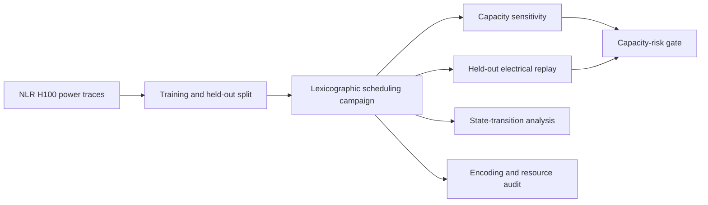

# PowerShape-Q

PowerShape-Q is the computational companion to a study of waveform-aware
energy scheduling for deferrable generative-AI inference batches. It combines
measured NVIDIA H100 power traces, lexicographic mixed-integer optimisation,
held-out electrical replay, transition uncertainty and encoding-aware quantum
resource estimation.

The repository contains analysis code only. Figures and manuscript-building
utilities are maintained separately.

## Scope

The workflow:

- constructs run-level offline-inference workload models from measured power
  traces;
- represents total IT power with a measured hardware-idle baseline and explicit
  idle-to-active transitions;
- constrains feeder power and average ramp rate over 1, 5 and 30 seconds;
- maximises admitted requests before minimising peak demand for the same jobs;
- evaluates schedules on held-out measured runs and under tighter feeder
  limits; and
- derives pairwise-model leakage, signed quadratic interactions and
  architecture-dependent quantum resource counts.



## Repository layout

All executable files are kept in the single `scripts/` directory.

| Group | Script | Purpose |
|---|---|---|
| Core campaign | `run_revision_experiments.py` | Builds workload cells, solves the three scheduling formulations and performs held-out replay. |
| Capacity validation | `capacity_sensitivity.py` | Re-solves the robust formulation from 10 to 26 kW. |
| Capacity validation | `capacity_replay.py` | Replays robust schedules at the binding 10, 12 and 14 kW limits. |
| Capacity validation | `compute_capacity_risk_gate.py` | Computes one-sided Clopper-Pearson bounds for the declared power-risk gate. |
| Transition validation | `state_transition_sensitivity.py` | Replays schedules under alternative idle states and transition durations. |
| Transition validation | `run_transition_uncertainty.py` | Re-optimises against a joint 1--5 s transition-duration envelope. |
| Quantum resources | `quantum_resource_revision.py` | Audits pairwise leakage, quadratic interactions, slack-variable counts and architecture-level resources. |
| Certification support | `rerun_uncertified_mode.py` | Re-runs an individual seed and formulation with an extended solver limit. |
| Certification support | `merge_reruns.py` | Merges certified re-runs into the campaign outputs. |

## Requirements

- Python 3.11
- NumPy 1.26.4
- pandas 2.2.2
- SciPy 1.13.1

Create an isolated environment and install the tested dependencies:

```bash
python -m venv .venv
python -m pip install --upgrade pip
python -m pip install -r requirements.txt
```

## Data

Download the public [Dataset of Generative AI Workload Power
Profiles](https://data.nlr.gov/submissions/312) and set
`POWERSHAPE_Q_DATASET` to its extracted root directory. The code reads the
source archive without modifying it.

PowerShell:

```powershell
$env:POWERSHAPE_Q_DATASET = "D:\path\to\Dataset of Generative AI Workload Power Profiles"
```

Bash:

```bash
export POWERSHAPE_Q_DATASET="/path/to/Dataset of Generative AI Workload Power Profiles"
```

The expected offline-inference input is:

```text
${POWERSHAPE_Q_DATASET}/01_aggregated_datasets/inference_offline_llama3_70b/metadata.csv
```

## Running the analyses

Run the primary 24-instance campaign first. It creates the repository-level
`results/` directory used by the downstream checks.

```bash
python scripts/run_revision_experiments.py \
  --seeds 24 \
  --replays 200 \
  --time-limit 120 \
  --workers 4
```

Run the capacity analyses and the pre-declared risk gate:

```bash
python scripts/capacity_sensitivity.py
python scripts/capacity_replay.py
python scripts/compute_capacity_risk_gate.py
```

Run the state and transition analyses:

```bash
python scripts/state_transition_sensitivity.py
python scripts/run_transition_uncertainty.py \
  --seeds 24 \
  --replays 200 \
  --time-limit 120 \
  --workers 4
```

Run the encoding and quantum resource audit:

```bash
python scripts/quantum_resource_revision.py
```

If a campaign row reaches the solver time limit without certification, re-run
that row and merge the certified result:

```bash
python scripts/rerun_uncertified_mode.py \
  --seed 9 \
  --mode deterministic \
  --time-limit 600 \
  --replays 200
python scripts/merge_reruns.py
```

The full campaign solves repeated mixed-integer programmes and may take several
hours. Solver status, optimality gaps and certification flags are retained in
the generated CSV and JSON files.

## Reproducibility

Random splits, workload instances and held-out replays use explicit seeds. The
source measurements are never overwritten. Derived CSV, JSON and NumPy files
are written to `results/`, which is excluded from version control because it
can be regenerated from the public dataset and the scripts in this repository.

The optimisation routines use SciPy's HiGHS-backed `milp` interface. Exact
wall-clock times may vary by processor and worker count; feasibility,
certification status and mixed-integer gaps are recorded with each campaign
result.

## Data citation

The measurements are provided by Vercellino *et al.*, *Measurement of
Generative AI Workload Power Profiles for Whole-Facility Data Center
Infrastructure Planning*, arXiv:2604.07345 (2026),
[doi:10.48550/arXiv.2604.07345](https://doi.org/10.48550/arXiv.2604.07345).
